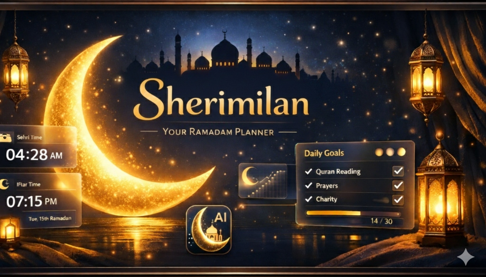

<p align="center">
  
</p>

<h1 align="center">🌙 SehriMilan - The Ultimate Ramadan Planner</h1>

<p align="center">
  <a href="https://nextjs.org/"></a>
  <a href="https://www.typescriptlang.org/"></a>
  <a href="https://supabase.com/"></a>
  <a href="https://capacitorjs.com/"></a>
  <a href="https://opensource.org/licenses/MIT"></a>
</p>

**SehriMilan** is a premium, open-source Ramadan Assistant designed to elevate your spiritual journey. From personalized Iftar and Sehri planning to nutrition insights and real-time shopping lists, it’s the only companion you need this Ramadan.

---

## ✨ Key Features

- 🧠 **Dynamic Planning**: Personalized meal suggestions based on nutritional needs.
- 🕒 **Real-time Schedules**: Accurate Iftar & Sehri timings with beautiful countdowns.
- 🛒 **Smart Shopping List**: Sync your grocery needs effortlessly across devices.
- 🔐 **Secure Auth**: Supabase-powered authentication for personalized data persistence.
- 📱 **Cross-Platform**: Seamless experience on Web and Android (Native APK available).
- 🎨 **Premium UI/UX**: Cinematic glassmorphism design with royal purple and gold aesthetics.
- ⚡ **Local Caching**: Instant load times with background cloud synchronization.

---

## 🚀 Tech Stack

- **Frontend**: Next.js 15 (App Router), TypeScript, Framer Motion, Tailwind CSS
- **Backend/DB**: Supabase (Auth & PostgreSQL)
- **AI/LLM**: Google Gemini API (for plan generation)
- **Mobile Foundation**: Capacitor.js
- **Design**: Vanilla CSS & custom micro-animations

---

## 🛠️ Getting Started

### Prerequisites

- Node.js (v18+)
- Java 17 (for Android builds)
- Supabase Account (for database & auth)
- Google AI Studio API Key (for Gemini)

### Installation

1. **Clone the repo:**
   ```bash
   git clone https://github.com/Sankalp28Roop/Ramadan-Iftar-and-Sehri-Planner.git
   cd Ramadan-Iftar-and-Sehri-Planner
   ```

2. **Web Setup:**
   ```bash
   cd web
   npm install
   ```

3. **Configure Environment:**
   Create a `.env.local` file in the `web` directory:
   ```env
   NEXT_PUBLIC_SUPABASE_URL=your_supabase_url
   NEXT_PUBLIC_SUPABASE_ANON_KEY=your_supabase_anon_key
   NEXT_PUBLIC_GEMINI_API_KEY=your_gemini_api_key
   ```

4. **Run Development Server:**
   ```bash
   npm run dev
   ```

5. **Android Build:**
   ```bash
   cd ../mobile-app
   npm install
   npm run sync
   npm run build:apk
   ```

---

## 📱 Mobile App (Android)

The app is optimized for Android via Capacitor, featuring:
- **Custom Splash Screen**: Cinematic entry with the SehriMilan emblem.
- **Offline Readiness**: Fast loading with static export optimization and local storage caching.

---

## 📄 License

Distributed under the MIT License. See `LICENSE` for more information.

## 👨‍💻 Created By

**Sankalp Swaroop**
- [GitHub](https://github.com/Sankalp28Roop)
- [LinkedIn](https://www.linkedin.com/in/sankalp-swaroop-34a749209/)

---

<p align="center">
  <i>Developed with ❤️ for the Humanity</i>
</p>
